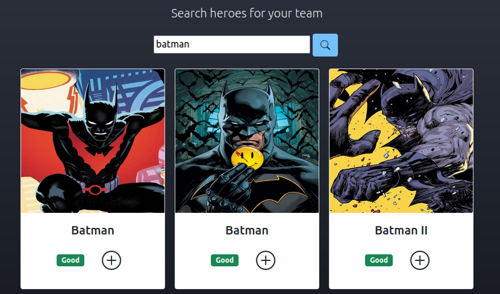
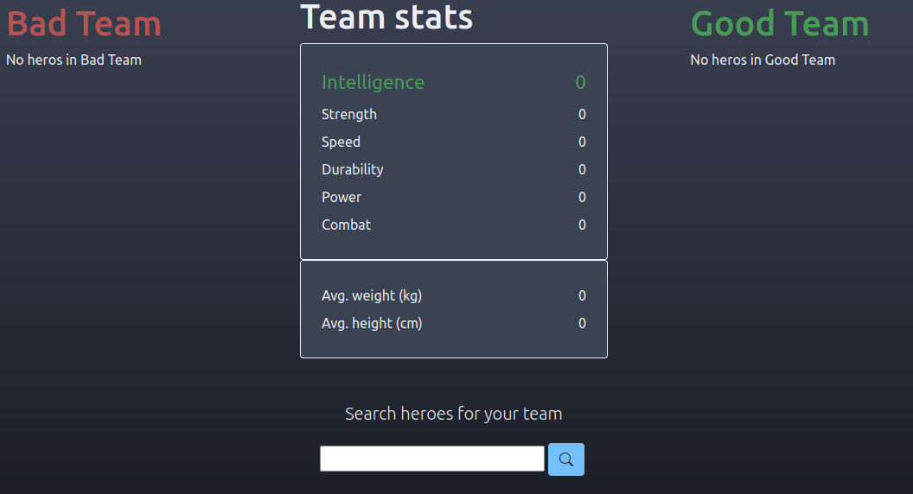
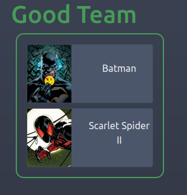
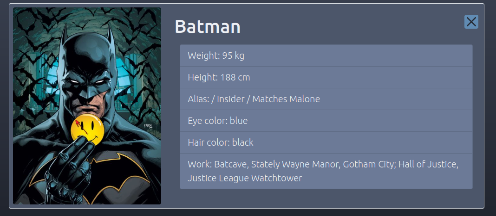

# Alkemy Challenge - Christian Caracach

Éste es el repositorio del proyecto que preparé para acceder a la aceleración de Alkemy.

Antes que nada, gracias a Alkemy por la oportunidad.

## Superhero challenge

Lo que podés ver en éste repositorio se trata de una app para visualizar superhéroes/superheroínas y agregarlas a tu equipo.

Para acceder vas a tener que loguearte con el mail __challenge@alkemy.org__ y la contraseña **react**.

La **API** que vamos a consumir es [SuperHeroAPI](https://superheroapi.com/).

## Funcionalidades

Dentro de las funcionalidades, podés buscar héroes de la API, agregarlos a tu equipo (pueden ser malos o buenos),

revisar información detallada de cada héroe,

y quitarlos de tu equipo si no estás conforme.

Además contás con información de los powerstats de cada héroe en tu equipo, y una suma de los stats totales (y promedios de peso y altura). La stat que más puntos tenga en tu equipo, se pinta de otro color.

## Login

El login tiene la particularidad de que cuando se envía la información de email y contraseña, obtiene un token de vuelta y lo guarda en LocalStorage para no tener que repetir el log cada vez que se entra en la app.

## Instalación

- Primero, cloná el repositorio **git clone https://github.com/Chriscaracach/alkemyChallengeCaracach** ,

- Después, instalá las dependencias con **npm install**.

- Corrélo en tu pc con **npm start**.

## Si solo te interesa utilizar la app sin ver el repositorio, podés verla [ACÁ](https://alkemychallengeccaracach.web.app/) .
